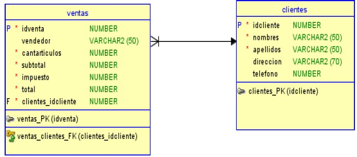
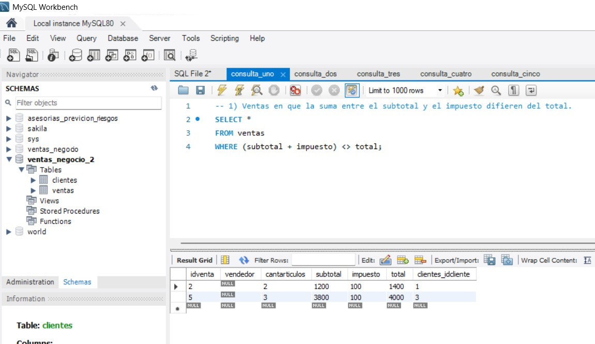
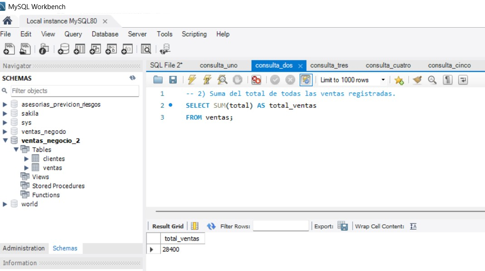
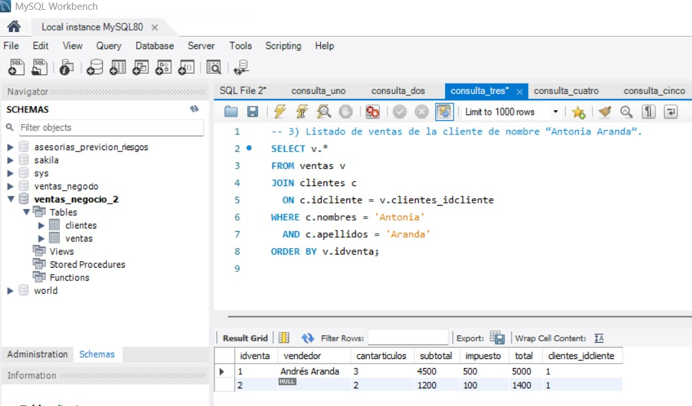
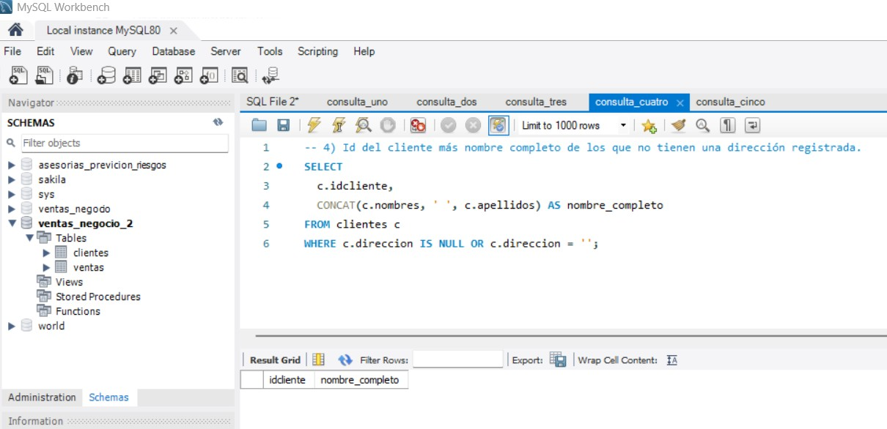
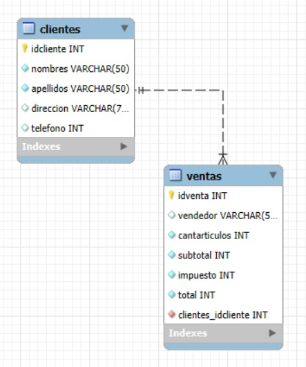

**_<h1 align="center">:vulcan_salute: Base de Datos Ventas Negocio Versión 2 :computer:</h1>_**


**<h3>:blue_book: Contexto de la Actividad:</h3>**

<p>Un negocio minorista desea llevar registro de las ventas diarias realizadas. Para ello ha creado el siguiente modelo de datos.</p>



<p>Algunas consideraciones respecto del modelo:</p>
<ul>
    <li>Los campos antecedidos por “P” son llaves primarias.</li>
    <li>Los campos antecedidos por “F” son llaves foráneas. El formato de su nombre es TABLA_CAMPO, donde TABLA es el nombre de la tabla a la que está asociado dicho campo, y CAMPO el nombre del campo de asociación.</li>
</ul>
<p>Los campos antecedidos con un “*” son obligatorios; en caso contrario son de tipo optativo.</p>

**<h3>:orange_book: Requerimientos:</h3>**

<p>En un archivo de texto, indique las siguientes consultas:</p>
<ul>
    <li>Una consulta que permita obtener todas las ventas tales que la suma entre el subtotal y el impuesto difieren del total.</li>
    <li>Una consulta que permita conocer la suma del total de todas las ventas registradas.</li>
    <li>Una consulta que permita conocer el listado de ventas de la cliente de nombre “Antonia Aranda”.</li>
    <li>Una consulta que despliegue el identificador del cliente, junto con su nombre y apellidos juntos en un solo campo. Debe desplegar solo los clientes que no tienen una dirección registrada.</li>
    <li>Una consulta que permita saber, al mismo tiempo, el monto de la mínima venta y máxima venta registrada en la tabla respectiva.</li>
</ul>

**<h3>:green_book: Construcción de la Base de Datos:</h3>**

<p>Creando la base de datos con las tablas ventas y clientes:</p>

```SQL
CREATE TABLE clientes (
  idcliente INT PRIMARY KEY NOT NULL,
  nombres   VARCHAR(50) NOT NULL,
  apellidos VARCHAR(50) NOT NULL,
  direccion VARCHAR(70),
  telefono  INT
);

CREATE TABLE ventas (
  idventa INT PRIMARY KEY NOT NULL,
  vendedor VARCHAR(50),
  cantarticulos INT NOT NULL,
  subtotal INT NOT NULL,
  impuesto INT NOT NULL,
  total INT NOT NULL,
  clientes_idcliente INT NOT NULL
);

ALTER TABLE ventas
ADD CONSTRAINT ventas_clientes_fk 
FOREIGN KEY ( clientes_idcliente )
REFERENCES clientes ( idcliente );
```

<p>Alimentando la base de datos:</p>

```SQL
INSERT INTO clientes VALUES (1,'Antonia','Aranda','Calle Los Aromos #123',991111111);

INSERT INTO clientes VALUES (2,'Bernarda','Barros','Pasaje Manuel Balmaceda #456',992222222);

INSERT INTO clientes VALUES (3,'Carlos','Costa','Avenida Simón Bolivar #789',993333333);

INSERT INTO ventas (idventa, vendedor, cantarticulos, subtotal, impuesto, total, clientes_idcliente) VALUES (1,'Andrés Aranda',3,4500,500,5000,1);

INSERT INTO ventas (idventa, cantarticulos, subtotal, impuesto, total, clientes_idcliente) VALUES (2,2,1200,100,1400,1);

INSERT INTO ventas (vendedor, idventa, subtotal, cantarticulos, impuesto, total, clientes_idcliente) VALUES ('Cristina Cortés',3,10480,5,20,10500,2);

INSERT INTO ventas (idventa, vendedor, cantarticulos, subtotal, impuesto, total, clientes_idcliente) VALUES (4,'Daniela Durán',1,5000,2500,7500,2);

INSERT INTO ventas (idventa, cantarticulos, clientes_idcliente, subtotal, impuesto, total) VALUES (5,3,3,3800,100, 4000);
```

**<h3>📁 Estructura del Proyecto:</h3>**

```
📁ventas_negocio_2
└── 📁img
│    └── 📁wireframes
│        └── wireframe_bbdd.jpg
└── 📁mysql
    ├── alimentando_bbdd_tclientes_tventas.sql
    ├── 📁tabla_clientes
    │   ├── creando_tabla.sql
    │   └── x.
    └── 📁tabla_ventas
        ├── creando_tabla.sql
        └── x.
```

**<h3>:blue_book: Consultas ejecutadas:</h3>**

1. Ventas en que la suma entre el subtotal y el impuesto difieren del total.
```SQL 
SELECT *
FROM ventas
WHERE (subtotal + impuesto) <> total;
```



2. Suma del total de todas las ventas registradas.
```SQL
SELECT SUM(total) AS total_ventas
FROM ventas;
```


3. Listado de ventas de la cliente de nombre “Antonia Aranda”.
```SQL
SELECT v.*
FROM ventas v
JOIN clientes c
  ON c.idcliente = v.clientes_idcliente
WHERE c.nombres = 'Antonia'
  AND c.apellidos = 'Aranda'
ORDER BY v.idventa;
```


4. Id del cliente más nombre completo de los que no tienen una dirección registrada.
```SQL
SELECT
  c.idcliente,
  CONCAT(c.nombres, ' ', c.apellidos) AS nombre_completo
FROM clientes c
WHERE c.direccion IS NULL OR c.direccion = '';
```


5. Monto de la mínima venta y de la máxima venta registradas.
```SQL
SELECT 
  MIN(total) AS venta_minima,
  MAX(total) AS venta_maxima
FROM ventas;
```


**<h3>:book: EER Diagram:</h3>**


